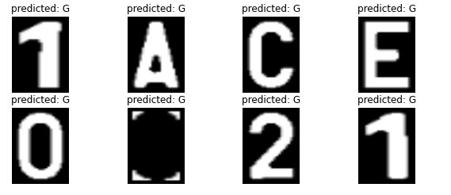

# Deep learning research

I've been playing with the [following](https://github.com/SarthakV7/AI-based-indian-license-plate-detection) project a bit. To change the model to fit our needs. First of all, the dataset that came with the repo was pretty accurate. Even on belgian number platse we were able to achive really damn good results. But now I wanted to add another dataset that we found online. In this dataset we have 1000 pictures for each number and letter! (in the one that was in the repo we only had like 30 per number and letter.)

## Using our own data-set

### Problems

So to start of here, the dataset that came with the repo had pictures with size (32px32p) while our dataset had pictures of (75px100p). So since a picture is a 3d matrix and the training model takes in the decimal values of each pixel one could say that for the exact same network the training would take around 7times as long ((75x100)/(32x32)). And not only that but with the diference that our data set has a total of around 28.000 pictures while the one that came with the repo had around 1.080 pictures (30x36). Wich would make the training go around 196(7x28) times SLOWER!! But we tried it. it gave us approximately 1hour and 50 minutes per epoch (while we even cheated and only let him use half of the pictures). for 50 epochs would mean 91 hours of training or almost 4 days.

### Solution

The solution is pretty simple. Ai's train good on gpu's. And at home i have a gtx960 in my desktop pc. So we figured lets go and use that. Well after 4hours of installing Cuda, and Cudnn. (we needed the right versions to work with tensorflow not all of them work. And for cudnn you need a developer acount on nvidea's website). We got it to work. Instead of 1hour and 50 minutes per epoch when running on the 1024Cuda cores that are arravailable in the gtx960 we got the time down to around 6 minutes per epoch. Wich still is 5hours of training.

## First test

While training the model seemed prommising (in the end we had an accuricy of 0.9949%). It dint quite work out as intended.

As one can see in the following picture the moddel makes horrible predictions.

Yeah... It guessed 'G' for all letters wich is very confusing.
Something that makes me believe the reason for this is the fact that we added a batch size. it was default on 0 so the network used all pictures it had in one epoch. I set it to 5. so instead of using all 28thousand pictures it used 5673. (We did this becouse we dint have time to let it train for 5 hours) And we have no clue wich ones he picked. so it might be that the network chose to pick all 1000 pictures of 'G' to train on and then spread the rest over the other numbers and letters.

## Second test

The next test would be to let the ai train with all 28thousand pictures. Let's see how it does for 50 epochs.